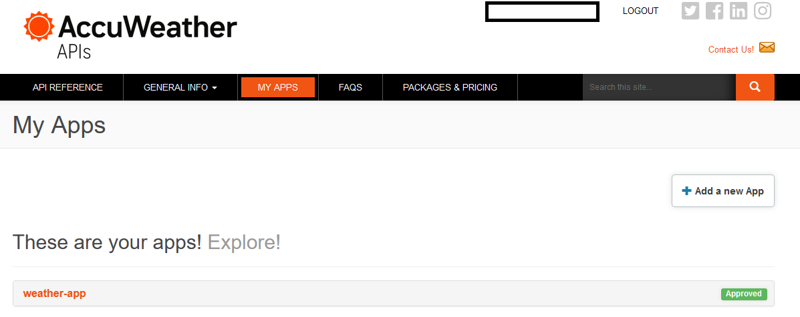

# Python weather console app
[](https://dl.circleci.com/status-badge/redirect/gh/santimontaner/weather-console-app/tree/develop)

## Install
To install this CLI applicaton follow these steps:
1. Install the requirements:
```bash
pip install -r requirements.txt
```
Alternatively, if you use the `conda` environment manager, you can create an environment using the `conda/environment.yml` file executing this command:
```bash
conda env create -f conda/environment.yml
```

2. Run this command from the root repository folder to install the application:
```bash
pip install .
```

## Configuration

The first time application is ran, a `.weatherconsoleapp` folder is created in your user folder (the `~/` folder in Linux, the `C:\Users\SantiMontaner` folder in Windows 10). Inside there should be a *config.ini* file
with this content:
```
[accuweather]
apikey=
```
The apikey value should be set with a valid Accuweather API key. To obtain an Accuweather API key follow these steps:
1. Get registered at the Accuweather developers [website](https://developer.accuweather.com/).
2. Once you are registered, log in and click on the **Add a new app** button from the **MY APPS** tab:

3. Once you create the new app, the API key will be revealed if you click on the name of your app. In the example, the app name is **weather-app**.


## Usage

### Current weather
Returns current weather at the specified location (format must be **City,COUNTRYCODE** with the specified units (**metric** or **imperial**, default is **metric**).

When executing this command:
```
weatherconsoleapp current Teruel,ES --units=metric
```
The output in the console is:
```
TERUEL (ES)
Nov 16, 2022
> Weather: Cloudy.
> Temperature: 10.80 ºC
```

### Weather forecast
Returns the weather for next 5 days starting from current date. Accepts optional **units** and **days** (between 1 and 5) arguments.

When executing this command:
```
weatherconsoleapp forecast Clermont-Ferrand,FR --units=imperial --days=3
```
The output in the console is:
```
CLERMONT-FERRAND (FR)
Nov 16, 2022
> Weather: Partly sunny w/ showers.
> Temperature: 53.50 ºF
Nov 17, 2022
> Weather: Showers.
> Temperature: 47.00 ºF
Nov 18, 2022
> Weather: Mostly cloudy.
> Temperature: 42.50 ºF
```
* The **Weather** line describes the weather during the day.
* The **Temperature** line returns the average of the day and night temperatures.

## TODOs
* Pass request factory ar arguments to the AccuWeatherApiConnector in order to increase test coverage.
* Return more meaningful messages to the user when Accuweather API do not return successful results.
* Migrate to modern pyproject.toml file.
* Clean the main.py file.
